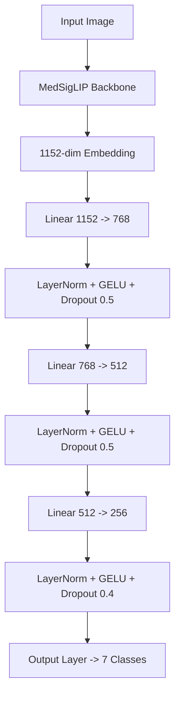

# 🩺 Nail Disease Detection with MedSigLIP (Kaggle Edition)

This repository contains a high-performance, specialized AI pipeline for detecting nail diseases using Google's **MedSigLIP** (Medical SigLIP Vision-Language Model). We leverage state-of-the-art transfer learning, automated hyperparameter optimization, and robust data augmentation to achieve expert-level accuracy.

## 🧠 The Algorithm: MedSigLIP

Our core algorithm is **MedSigLIP (Medical Sigmoid Loss for Language Image Pre-training)**, primarily the `google/medsiglip-448` variant.

### Why MedSigLIP?
Unlike standard vision models (like ResNet or EfficientNet) trained on generic ImageNet data (cats, dogs, cars), MedSigLIP is a **Vision-Language Model (VLM)** pre-trained on a massive dataset of medical image-text pairs.
- **Domain Alignment**: It already "understands" medical concepts, textures, and biological structures.
- **SigLIP Loss**: Uses a sigmoid loss function which allows for better scalability and performance in multi-label/multi-class settings compared to traditional Softmax-based contrastive learning.
- **High Resolution**: The `448` variant processes images at $448 \times 448$ resolution, capturing fine-grained details critical for dermatological diagnosis (e.g., small pits in psoriasis).

## 🏗️ Technical Architecture

The pipeline consists of two main stages:

### 1. Feature Extraction (Backbone)
- **Input**: $448 \times 448$ RGB Images.
- **Model**: `google/medsiglip-448` Vision Transformer (ViT).
- **Function**: Extracts a sophisticated 1152-dimensional embedding vector that represents the semantic content of the image.

### 2. Classification Head (Custom Design)
We do not simply use a single linear layer. We designed a custom Multi-Layer Perceptron (MLP) head to map the rich embeddings to our 7 specific disease classes:

## ⚙️ How We Achieve High Accuracy

We employ several advanced techniques to push performance beyond standard baselines:

### 1. Automated Hyperparameter Tuning (Optuna)
We don't guess learning rates. We use **Optuna**, a hyperparameter optimization framework, to mathematically determine the best configuration for your specific dataset.
- **Search Space**:
  - Learning Rate: Log-scale search ($1e-5$ to $1e-3$).
  - Batch Size: 16 vs 32.
  - Optimizer: AdamW vs SGD.
- **Mechanism**: Runs multiple short trials, prunes unpromising ones early, and selects the optimal parameters for the full training run.

### 2. Comprehensive Data Augmentation
To prevent overfitting and ensure the model generalizes to real-world photos (different lighting, angles, quality), we apply rigorous transformations during training:
- **Geometric**: Random Resized Crop (scale 0.8-1.0), Horizontal/Vertical Flips, Rotation ($\pm 30^\circ$), Affine translations.
- **Color/Texture**: Color Jitter (brightness, contrast, saturation, hue), Gaussian Blur (simulating out-of-focus shots).
- **Regularization**: Random Erasing (forcing the model to look at the whole nail, not just one feature).

### 3. Class Imbalance Handling
Medical datasets are rarely balanced (lots of healthy, few rare diseases). We calculate **Class Weights** inversely proportional to class frequencies:
$$ w_j = \frac{N_{total}}{N_{classes} \times N_j} $$
These weights are passed to the `CrossEntropyLoss` function, forcing the model to pay more attention to underrepresented classes (like Melanoma).

### 4. Advanced Training Dynamics
- **Layer Normalization & GELU**: Used in the classification head for stable gradients and non-linearity.
- **Dropout**: Aggressive dropout (0.4 - 0.5) in the classifier to prevent memorization of training data.
- **Mixed Precision (FP16)**: Utilized (via Kaggle GPU) to speed up training and reduce memory usage without sacrificing accuracy.

## 🛠️ Technology Stack

- **Framework**: PyTorch
- **Model Library**: Hugging Face Transformers (`transformers`, `huggingface_hub`)
- **Backbone**: `timm` (PyTorch Image Models)
- **Optimization**: Optuna
- **Data Processing**: Torchvision, NumPy, Pandas, Pillow

## 📊 Evaluation & Selection

The best model is not just the one with high accuracy. We monitor:
- **Validation Loss**: To detect overfitting early.
- **F1-Score**: To ensure a balance between Precision and Recall (critical in medical diagnosis).
- **Confusion Matrix**: To visualize exactly which classes are being confused (e.g., distinguishing Psoriasis from Pitting).

---
*Built for the MedGemma Impact Challenge | Focusing on Human-Centered AI*
